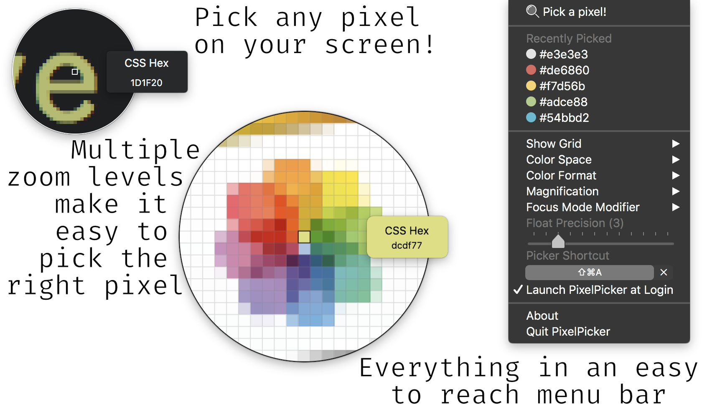

PixelPicker is like Digital Color Meter, but lives in your menu bar and lets you get the color of any pixel easily. Just hit your shortcut, up comes a magnifying glass, and away you go!

### Features

* 📸 Pick *any* pixel on your screen with ease
* 🔎 Different magnification levels
* ✏ Multiple color export formats
* 🖥 Multi-monitor support
* 🎨 Supports different color spaces
* ⌨️ Global keyboard shortcut activation
* 🌄 Customisable preview
* ✨



## Installation

Simply download the dmg from the [releases](https://github.com/acheronfail/pixel-picker/releases) tab and drag "Pixel Picker.app" into your `/Applications` folder.

## Usage

After you've installed PixelPicker, it will live in your menu bar. You have many different ways of activating the picker:

* Configure a keyboard shortcut in the dropdown menu and press that to activate the picker
* Select the "Pick a Pixel" item in the dropdown menu to activate the picker
* Simply right-click the menu item and the picker will activate

Once you have the picker open, it should be quite straightforward! Move your mouse around the screen and click (or press <kbd>space</kbd> on the pixel you want.
You can also hold down the <kbd>control (⌃)</kbd> key (this can be changed to another key) while the picker is open, and the picker will enter "Focus Mode". This will zoom the pixel preview even further, and will slow down the picker's movement to make it easier to pick that hard-to-get pixel!

**ProTip:** Remember, you can use the left or right arrow keys to cycle between color formats while the picker is open.

### Options

All of PixelPicker's options are in its menubar dropdown. Simply click on the menu bar item, and you can configure the picker right there in your menu.

PixelPicker provides some neat options:

* 🔳 **Show Grid**
    * Whether or not to show a grid around the pixels in the picker's preview.
* 🎨 **Color Space**
    * Computer screens are complex things, and have various color spaces. You can either leave this setting as its default (it will choose the default color space of your screen) or you can specify a specific color space and PixelPicker will try and use that instead (compatibility depends on your computer's screen/monitor).
* ✏️ **Color Format**
    * How should the color be copied when you select it? Examples include CSS Hex: `#aabbcc`, or Java RGB: `new Color(158, 198, 117)`, etc.
* 🔍 **Magnification**
	- How far in should the preview zoom/how big should each pixel be?
* 🧐 **Focus Modifier**
    * Choose which modifier activates focus mode. When focus mode is active, the picker zooms even closer in, and your mouse moves slower to help you pick the right pixel.
* 🔢 **Float Precision**
    * This controls how many digits will come after the decimal point when using float-based color formats.
* ⌨️ **Picker Shortcut**
    * The global keyboard shortcut to use that will activate Pixel Picker.
* 🚀 **Launch at Login**
    * If this is enabled then PixelPicker will be launched when you log into your computer.

#### Extra Overrides or Hidden Settings

In some releases PixelPicker might have some experimental overrides that can be toggled via the Terminal (`defaults write ...`, etc). Look under the "Experimental Overrides" section at `PixelPicker` -> `About` for more information.

## Questions/Concerns

None yet!

## Developing

#### Setting up the project

PixelPicker uses `carthage` to manage its dependencies (you can install it with `brew`). To build PixelPicker on your machine:

```bash
# Clone the repository
git clone git@github.com:acheronfail/pixel-picker && cd pixel-picker
# Install dependencies with carthage
carthage update --platform macos
# Open the project
open PixelPicker.xcodeproj
```

Once you've opened the Xcode project, it should be enough to make your changes and then just hit the build/run button and go from there.

#### Creating a DMG

The process to create build artefacts for this app is extremely simple:

1. Archive a build in Xcode (`Products` -> `Archive`)
2. Export the app
3. Run [`create-dmg`](https://github.com/sindresorhus/create-dmg)
4. 🎉

## License

[GPLv3](./LICENSE)
